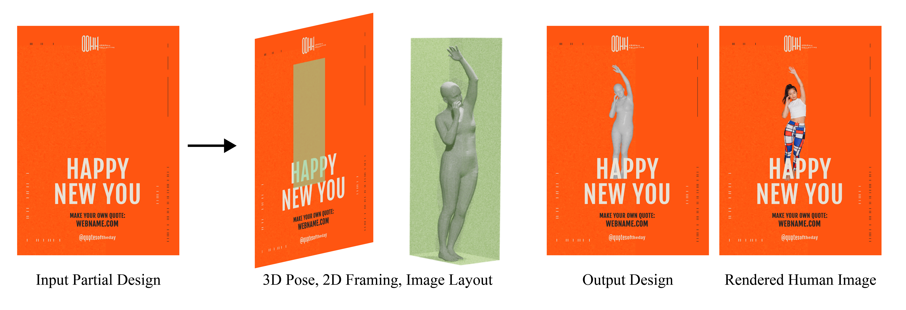
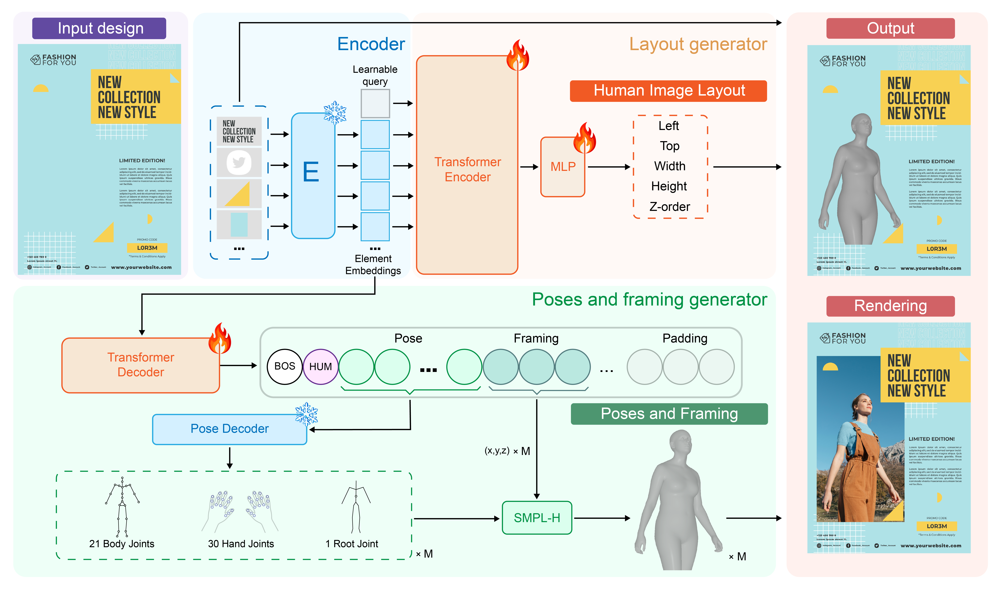
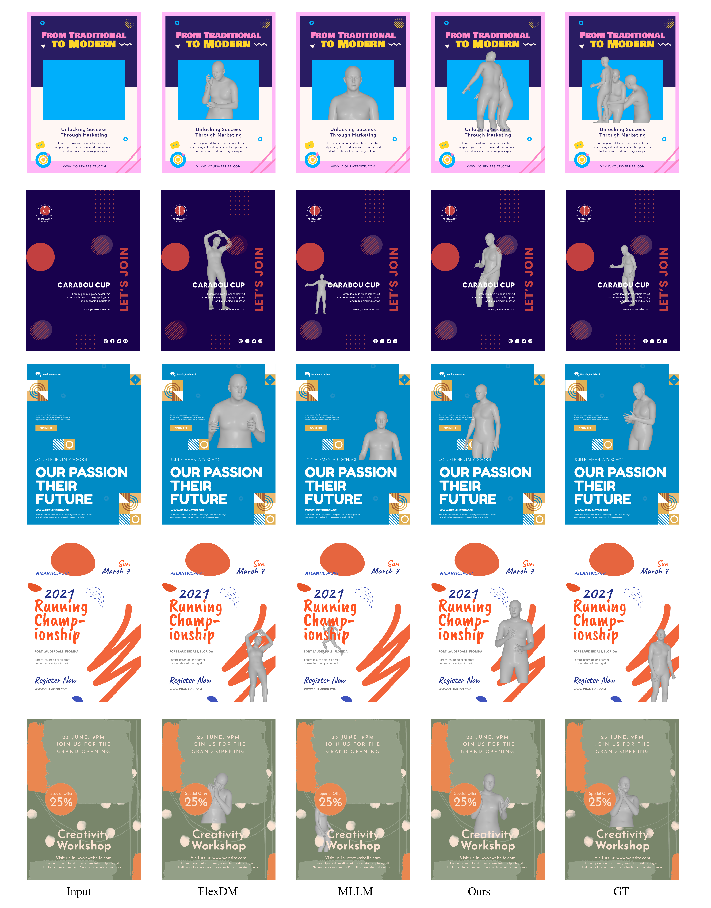
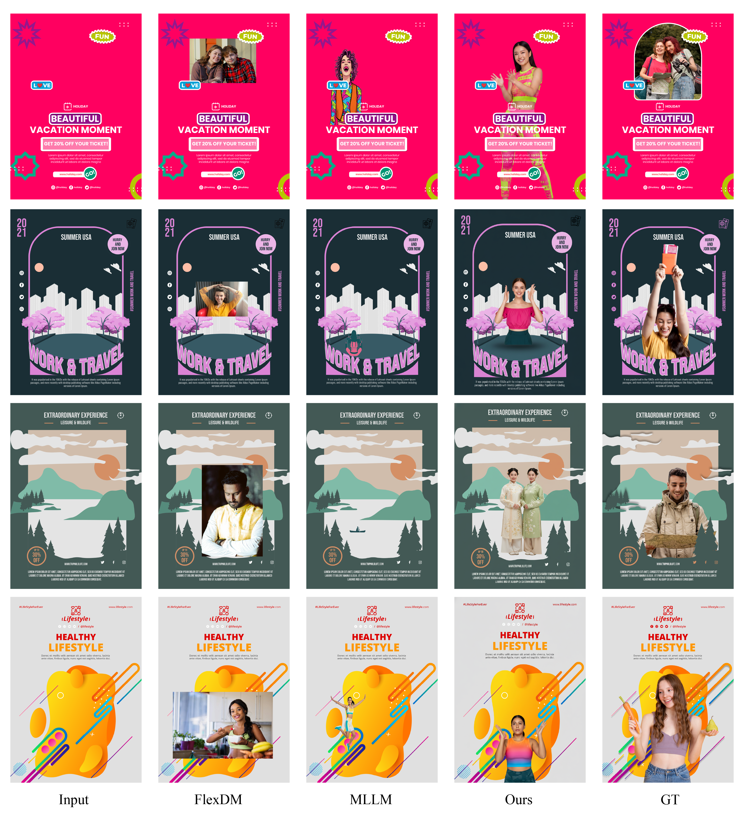
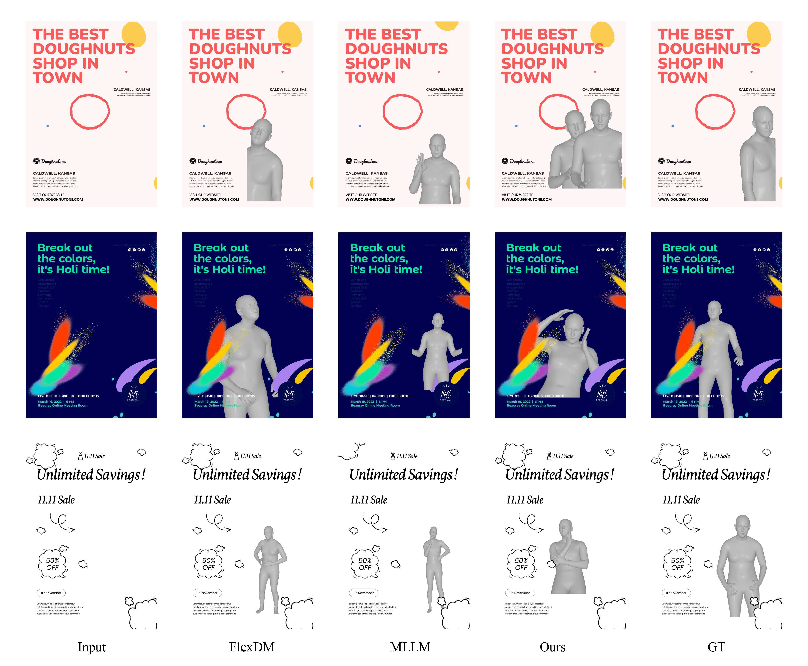

# Human-aware Design Generation: Adding 3D Humans into Graphic Designs

Official repository for **Human-aware Design Generation: Adding 3D Humans into Graphic Designs**.

> **Code and model weights coming soon.**

## Overview

Graphic designs frequently contain human images whose pose, framing, and placement are carefully designed to guide visual exploration and evoke particular feelings. Existing automatic graphic-design generation methods have largely overlooked the role of human representations in the design process.

We introduce **design-conditioned 3D human adding**, a task that adds a 3D human representation to an existing partial graphic design. Given a design containing elements such as images, vector shapes, and text, our model predicts:

- the 3D pose of the human;
- the 2D framing of the human image; and
- the spatial layout of the image containing the human within the design.

The predicted human and image layout are then integrated with the existing design elements to produce a cohesive complete design. Our experiments show improvements over baseline methods in 3D pose prediction, 2D framing, image layout harmonization, and holistic design quality.

## Visual Results

Click any image to open the full-resolution figure.

<p align="center">
  <a href="figure/fig1_teaser.png"></a>
</p>

<p align="center">
  <a href="figure/fig2_motivation.png"></a>
  <a href="figure/fig3_model.png"></a>
</p>

<p align="center">
  <a href="figure/fig4_comparison.png"></a>
  <a href="figure/fig5_rendering.png"></a>
</p>

<p align="center">
  <a href="figure/fig6_more_comparison.png"></a>
</p>

## Status

This repository provides the paper figures and project overview.

- [ ] Inference code
- [ ] Training code
- [ ] Pre-trained model weights
- [ ] Dataset and data-processing instructions
- [ ] Detailed installation and evaluation instructions

All of the above will be released soon.

## Repository Structure

```text
.
├── figure/              # Paper figures
├── sec/                 # Paper sections (not included in release)
├── figure/              # Paper figures and visual results
└── README.md
```

## Paper

**Human-aware Design Generation: Adding 3D Humans into Graphic Designs**  
Zijin Hou and Ying Cao  
ShanghaiTech University

Published in the *Proceedings of the 34th ACM International Conference on Multimedia (MM 2026)*.

- DOI: [10.1145/3767308.3836019](https://doi.org/10.1145/3767308.3836019)
- Paper/project materials: coming soon

## Citation

The BibTeX citation will be added when the final publication metadata is available.

```bibtex
@inproceedings{hou2026humanaware,
  title     = {Human-aware Design Generation: Adding 3D Humans into Graphic Designs},
  author    = {Hou, Zijin and Cao, Ying},
  booktitle = {Proceedings of the 34th ACM International Conference on Multimedia},
  year      = {2026},
  doi       = {10.1145/3767308.3836019}
}
```

## License

The license for the code, model weights, and associated materials will be specified when they are released.

## Contact

For questions, please contact:

- Zijin Hou: houzj2025@shanghaitech.edu.cn
- Ying Cao: caoying59@gmail.com
